# CareConnect

## Table Of Contents :

- [CareConnect](#careconnect)
  - [Table Of Contents :](#table-of-contents-)
  - [Overview](#overview)
  - [Features](#features)
  - [Technologies Used](#technologies-used)
  - [Core Functionality](#core-functionality)
  - [Installation and Setup](#installation-and-setup)
    - [Prerequisites](#prerequisites)
    - [Steps](#steps)
  - [Screenshots](#screenshots)
  - [PPT](#ppt)

## Overview
This project provides an emergency alert system designed to assist senior citizens living alone in connecting with nearby nurses in case of accidents or health emergencies. The system uses real-time geolocation tracking to identify the nearest available nurse and notifies them. If the nurse doesn't respond in a given timeframe, the system automatically notifies the next nearest nurse. Additionally, a chatbot feature processes both text and images, and a reminder alarm system assists in maintaining healthcare schedules.

## Features
- *Geolocation-Based Nurse Tracking*: Identifies and tracks the real-time location of nurses on duty.
- *Proximity Calculation*: Determines the nearest nurse to the patient based on geo-distance and estimated travel time.
- *Automated Notification System*: Continuously notifies the nearest nurse until one responds.
- *Chatbot*: Utilizes the Gemini API to process both text and image inputs for assisting with healthcare inquiries.
- *Reminder Alarm*: Notifies patients for scheduled healthcare tasks, such as medication or doctor visits.
- *Next.js Features*: Implements dynamic imports for efficient loading of large components, server-side rendering (SSR) for SEO optimization, and overall fast performance.

## Technologies Used
- *Next.js*: For server-side rendering and dynamic imports.
- *React*: To build the user interface.
- *TailwindCSS*: For responsive and modern UI design.
- *AceternityUI*: For additional UI components.
- *WebSockets*: For real-time notifications and communication.
- *Node.js*: Backend server for handling WebSocket communications.
- *Geolocation API*: Fetches real-time location of users and nurses.
- *Speech API*: Enables voice-based features, like setting reminders.
- *OpenStreetMap*: For displaying map data and locations.
- *Open Route Service*: Calculates the best travel route based on real-time data.

## Core Functionality
1. *Patient Call for Help*:
   - The patient initiates a notification for help, and the system captures their current location using the Geolocation API.
   - The system fetches a list of available nurses on duty within the patient’s region or city.
   
2. *Nurse Location Tracking*:
   - The system tracks real-time locations of nurses and calculates the nearest nurse using OpenStreetMap and Open Route Service.
   - The distance is calculated using the Haversine formula to identify the closest nurse and best travel route.

3. *Automated Notification*:
   - Nurses are notified of the patient’s call through WebSockets.
   - If the nearest nurse doesn’t respond within a specific timeframe, the next nearest nurse is contacted.

4. *Chatbot with Gemini API*:
   - A chatbot feature processes both text and image inputs, helping patients ask healthcare-related questions or send images for assistance.
   
5. *Reminder Alarm*:
   - Patients can set reminders using the system’s built-in alarm, which provides voice notifications through the Speech API for critical healthcare tasks.

## Installation and Setup
### Prerequisites
- Node.js
- Git
- Web browser (preferably Chrome)

### Steps
1. Clone this repository to your local machine.
2. Direct to folder where app, components, and directories are located.
3. open terminal and type ```npm install``` to install dependencies and ```npm install ws``` to install WebSockets.
4. Go to *Websocket/websocket-server* folder and type in terminal ```node server.js``` to run websocket server.
5. Go to *careconnect* directory and type in terminal ```npm rundev``` to start server.
6. You will be redirected to *http://localhost:3000* to access your server.
7. Careconnect.pptx is the powerpoint presentation of this project.

## Screenshots

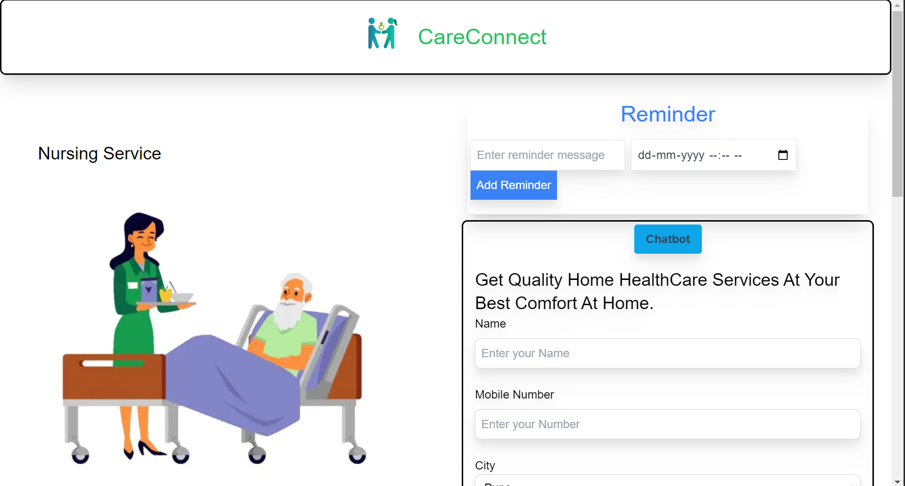

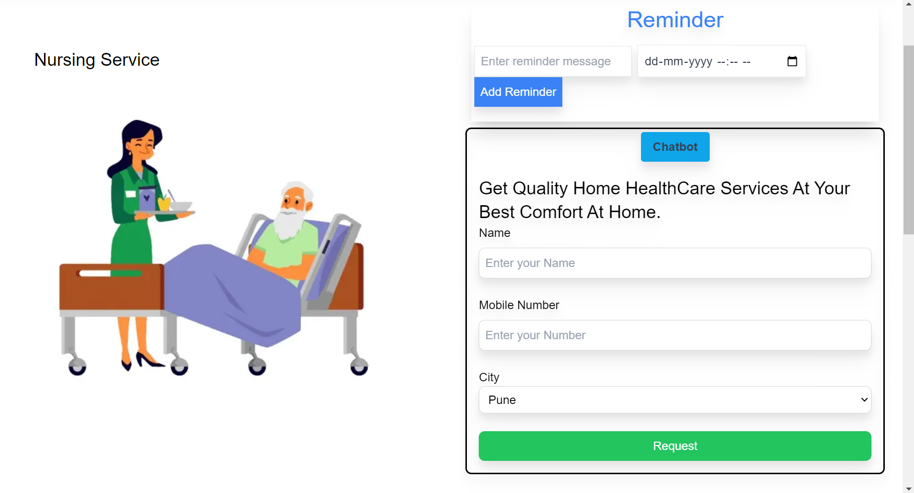

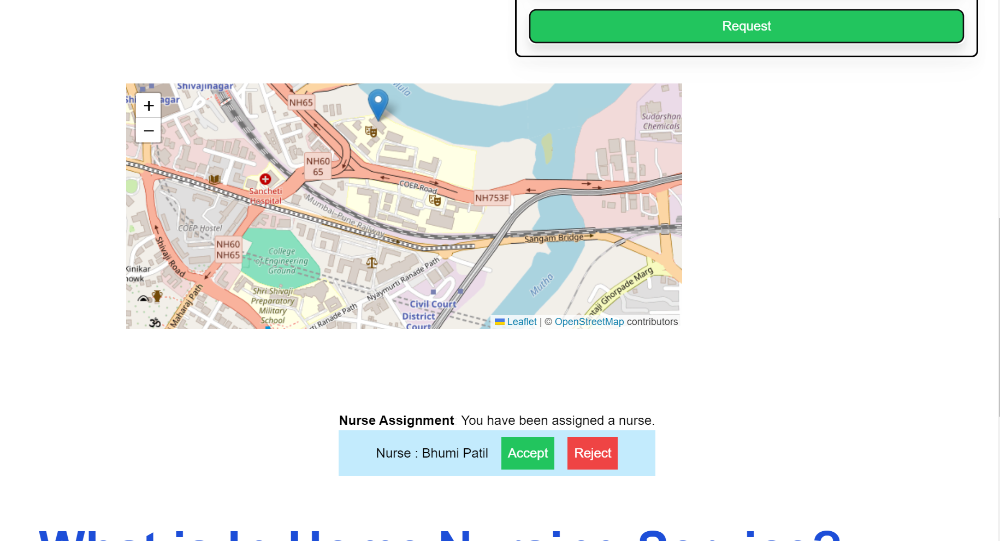

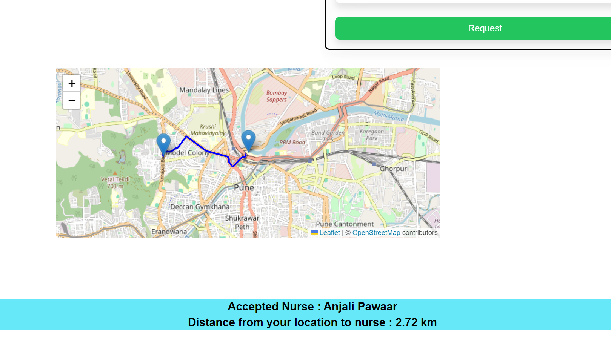

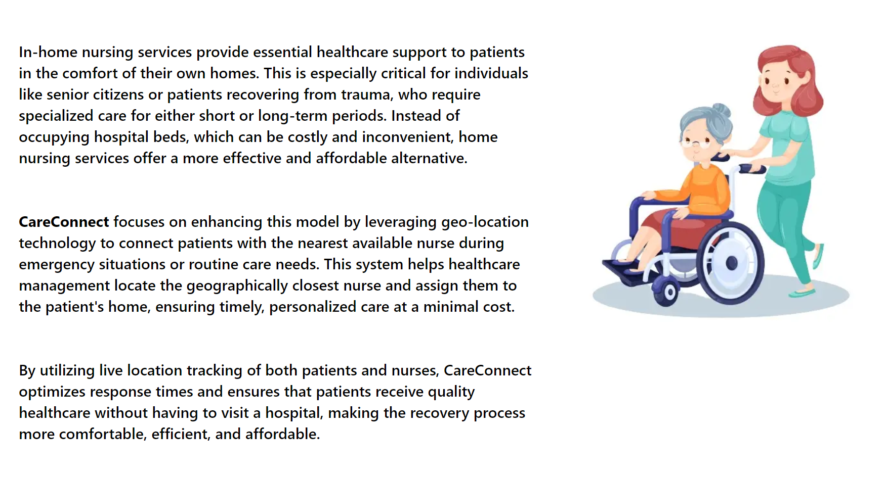

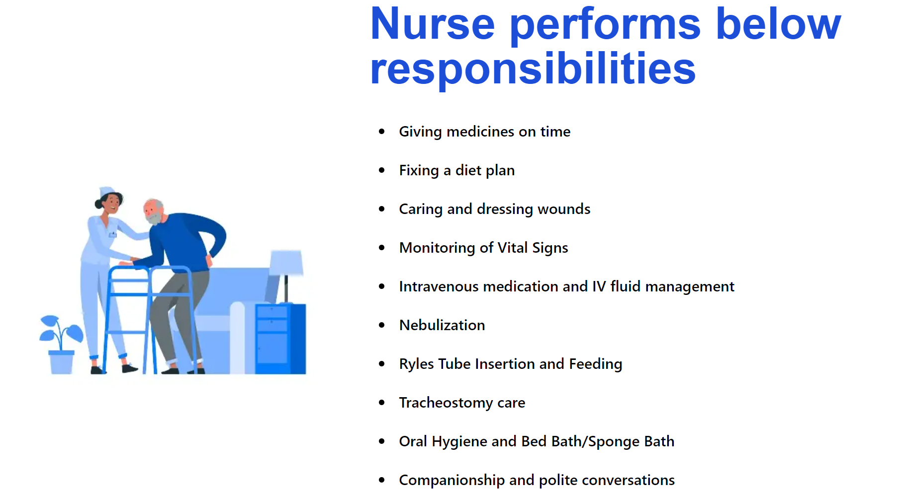

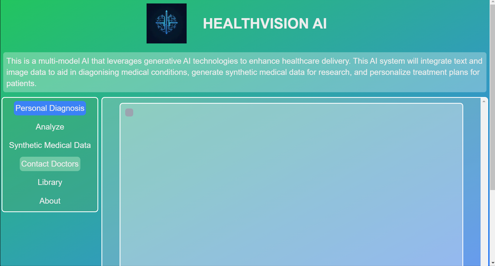

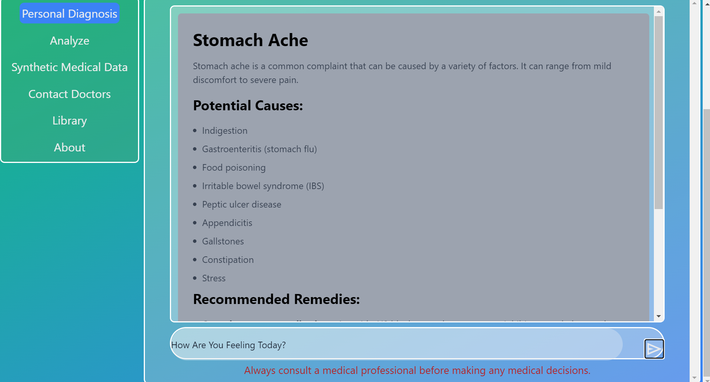

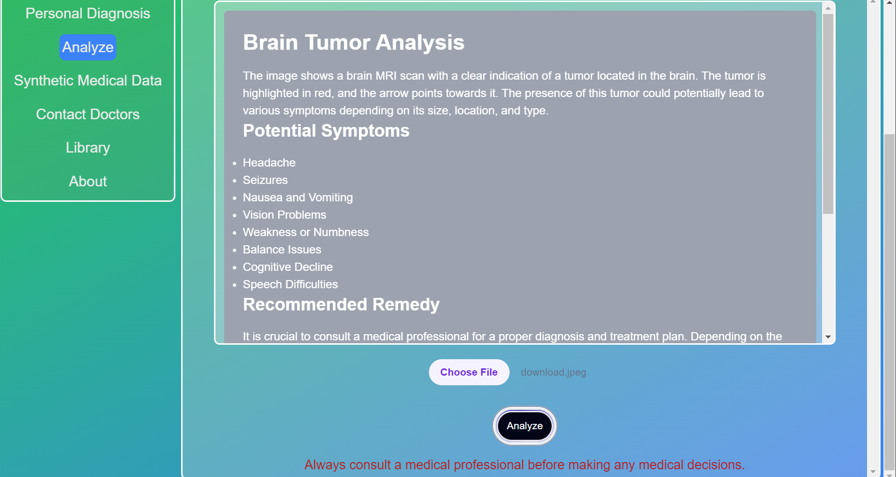

## PPT 

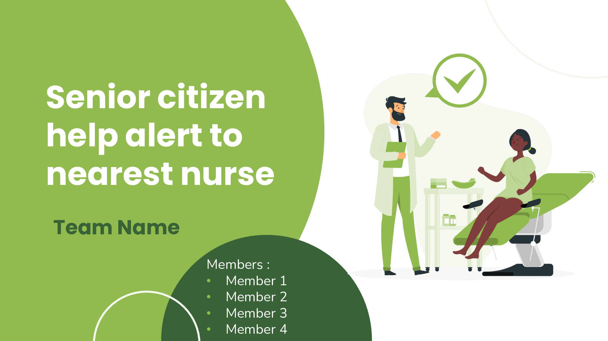

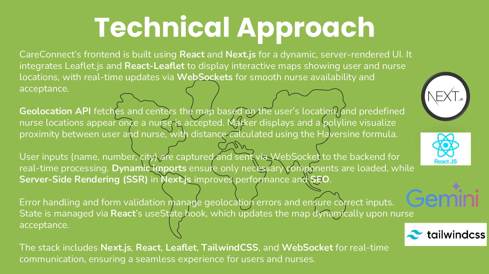

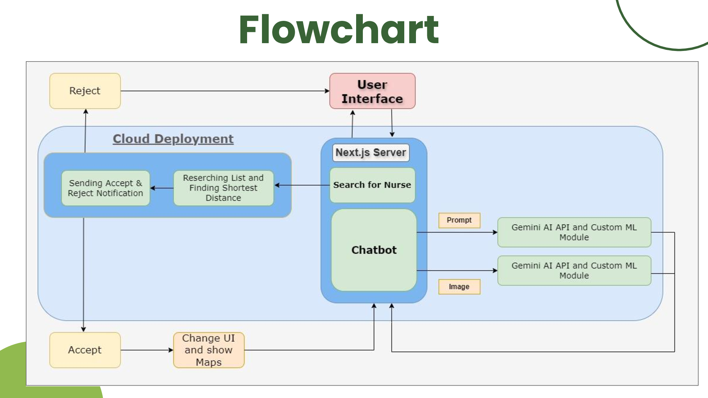

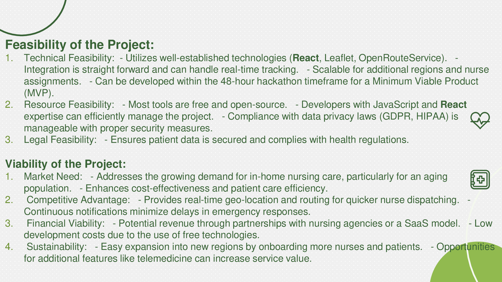

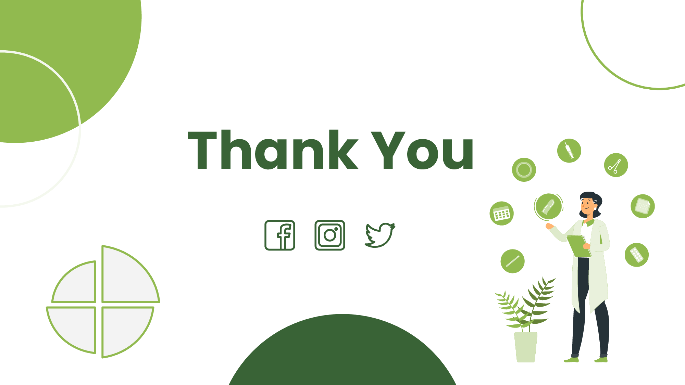